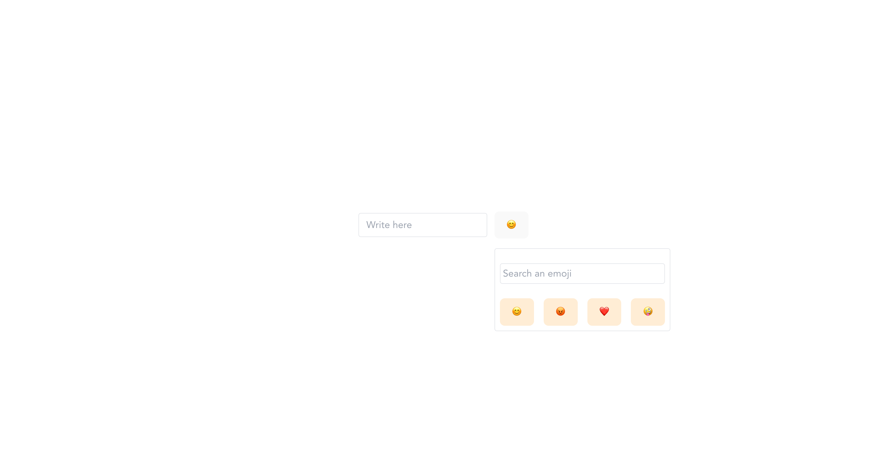

# Kruger Star - Emoji selector

## Table of contents

- [Overview](#overview)
  - [The challenge](#the-challenge)
  - [Screenshot](#screenshot)
  - [Links](#links)
- [My process](#my-process)
  - [Built with](#built-with)
  - [What I learned](#what-i-learned)
  - [Useful resources](#useful-resources)
- [Author](#author)
- [About Kruger Star](#about-kruger-star)


## Overview

### The challenge

Users should be able to:

- Write inside the input
- Add emojis when they need
- Search for an emoji
- Close the emojis box whenever they click outside of the menu
- View the optimal layout for the interface depending on their device's screen size
- See hover and focus states for all interactive elements on the page

### Screenshot




### Links

- Live Site URL: [click here](https://emoji-selector-six.vercel.app)

## My process

### Built with

- Semantic HTML5 markup
- CSS custom properties
- Flexbox
- [React](https://reactjs.org/) - JS library
- [Tailwind CSS](https://tailwindcss.com) - For styles
- [Vite](https://vitejs.dev)- Frotend tooling


### What I learned

How to close a component when the user click outside of it. In order to do it, you have to use something like this:

```js
useEffect(() => {
    window.addEventListener("click", (e) => {
      if (!containerRef.current.contains(e.target)) {
        setOpen(false);
        setEmojis([...list]);
      }
    });
  }, []);
```

Always assign a reference to the container div.

### Useful resources
[🔥 5 proyectos COMPLETOS en REACT JS](https://www.youtube.com/watch?v=oT-feDPuJmk&t=3788s) - In this tutorial is all the project step by step. It's illustrative in the functions that implements to create the selector.  


## Author

- Website - [Edwin Cacuango](https://edwinc.dev)
- Twitter - [@edwincacuango](https://www.twitter.com/edwincacuango)


## About Kruger Star

Kruger Star is a reality created and funding by Kruger Corporation. It help future developers to become fullstack developers, mean while they teach you about front and backend languages and tools. 
This project is a delivery part of Kruger Star initiative. For more information, visit the oficial site [here](https://ktalks.krugercorp.com/es/kruger-star-2022)
